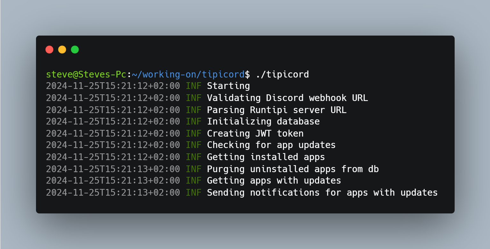

# TipiCord - The easiest way to check for app updates in your Runtipi instance 🔔

TipiCord is an extremely simple tool that periodically checks for app updates in your [Runtipi](https://github.com/runtipi/runtipi) instance and then sends notifications to your prefered Discord channel/server. It is super lightweight since and only ~20mb in size.

<div>
    
</div>

> [!WARNING]
> TipiCord only supports runtipi instances from v3.7.0 and above since this version added the ability to use an API to communicate with the server.

> [!WARNING]
> TipiCord is still in early stages of development so issues are to be expected. If you encounter any please create an issue so I can fix them as soon as possible.

## Roadmap

This project is still in early stages of development so it only includes the basic features but I am planning to add the following ones too.

- [ ] Multiple instances
- [ ] Configuration using environment variables
- [ ] Support for other notifications services (project rename)
- [ ] Possibly a CLI check mode like [Cup](https://github.com/sergi0g/cup)

## Getting started 🏃‍♂️

Right now there are no available binaries but I am working on releasing both a docker image and a binary, but for now you will have to [build](#building-️) it yourself using Go.

## Building 🛠️

To build the project you need to have Go and Git installed. 

You firstly have to clone the repository with

```bash
git clone https://github.com/steveiliop56/tipicord
cd tipicord
```

Then install dependencies

```bash
go mod tidy
```

And finally run it with

```bash
go run .
```

Or build it with

```bash
got build
```

If everything succeeds you should have a binary named `tipicord`.

> [!NOTE]
> You can also build for other operating systems/architectures using `GOOS=windows` and `GOARCH=arm64`.

## Contributing ❤️

This project is still in early stages of development so bugs are to be expected. If you are interested in helping with my terrible go skills, feel free to create a pull request. Any help is appreciated!

## License 📜

TipiCord is licensed under the GNU General Public License v3.0. TL;DR — You may copy, distribute and modify the software as long as you track changes/dates in source files. Any modifications to or software including (via compiler) GPL-licensed code must also be made available under the GPL along with build & install instructions.

## Acknowledgements 🙏

Thanks a lot to

- [Carbon](https://carbon.now.sh) for providing the awesome terminal screenshot